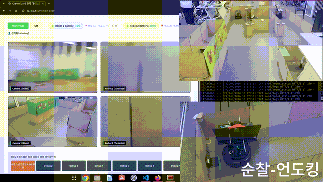
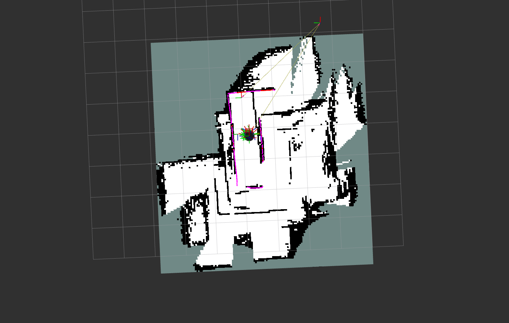

# GreenGuard AMR Navigation

ROS 2 Humble, TurtleBot4, Nav2, SLAM, AMCL을 활용한 스마트팜 AMR 자율주행 순찰 프로젝트입니다.

This repository documents my AMR navigation contribution in the GreenGuard team project conducted during the Doosan Robotics ROKEY Bootcamp 8th.

## Quick Summary

* Program: Doosan Robotics ROKEY Bootcamp 8th
* Project: GreenGuard smart-farm AMR patrol system
* Project type: Team project
* My role: AMR Navigation and Nav2 Patrol Control
* Robot platform: TurtleBot4
* Main stack: ROS 2 Humble, Nav2, SLAM, AMCL, RViz2, RPLIDAR, Python
* Main contribution: SLAM map generation, AMCL localization setup, waypoint collection, waypoint patrol control, and Nav2 speed tuning

## Project Overview

GreenGuard는 스마트팜 환경에서 AMR이 자율주행으로 순찰하며 작물 상태와 이상 상황을 확인하는 스마트팜 AMR 순찰 시스템입니다.

전체 시스템은 AMR 자율주행, TurtleBot4 위에 장착한 노트북의 내장 웹캠을 이용한 토마토 검사, 고정 웹캠 기반 특정 구역 객체 감지, YOLO 기반 객체 탐지, Mission Manager, SQLite3 DB, Flask Web UI로 구성되었습니다.

이 저장소는 팀 전체 시스템 중 제가 담당한 AMR Navigation 부분만 정리합니다.

## My Contribution Scope

제가 담당한 부분은 TurtleBot4가 SLAM으로 생성한 map 위에서 localization을 수행하고, waypoint를 따라 반복 순찰하도록 구성하는 AMR Navigation 파트였습니다.

직접 수행한 작업은 다음과 같습니다.

* 스마트팜 테스트 환경에 맞는 SLAM map generation
* RViz2를 이용한 map generation 상태 확인
* 생성된 map 기반 AMCL localization 확인
* Nav2 Goal을 이용한 목표 지점 이동 테스트
* RViz2 clicked point와 teleop을 활용한 waypoint 수집
* AMCL pose 기반 현재 위치 확인
* 현재 위치에서 가장 가까운 waypoint를 선택하는 patrol start logic 구성
* 지정된 waypoint sequence를 반복 주행하는 Python 기반 ROS 2 patrol control node 작성
* False loop closure 완화를 위한 SLAM parameter 조정
* 팀 통합 시스템의 카메라 기반 객체 탐지 안정성을 고려한 Nav2 speed parameter tuning

AMR Control은 팀 내에서 공동으로 진행되었습니다. 제 담당 범위는 map generation, waypoint collection, waypoint patrol route, and patrol-only navigation control이었습니다.

다른 팀원은 순찰 중 객체가 탐지되었을 때 AMR이 tracking behavior로 전환되는 기능을 구현했습니다. 또한 객체 탐지 이벤트가 발생했을 때 AMR을 특정 구역으로 출동시키고, 이후 추적 또는 복귀 동작으로 전환하는 이벤트 기반 동작도 팀 통합 시스템의 일부로 구현되었습니다.

YOLO detection, Web UI, DB monitoring, object-triggered tracking behavior는 팀 단위 통합 시스템의 일부였지만, 이 저장소에서는 제가 직접 담당한 AMR Navigation 부분만 다룹니다.

## System Context

GreenGuard의 전체 시스템은 다음 역할로 나뉘었습니다.

* TurtleBot4 AMR: Nav2 기반 자율주행, 목표 위치 이동, waypoint 순찰 수행
* Laptop mounted on TurtleBot4: TurtleBot4 위에 노트북을 장착했으며, 토마토 검사는 별도 카메라가 아니라 해당 노트북의 내장 웹캠만 사용했습니다.
* Fixed Webcam: 특정 구역에 객체가 감지되었는지 확인하고, AMR 출동 이벤트를 발생시키는 트리거 역할
* YOLO Detection: 토마토 및 특정 객체 탐지에 활용
* Mission Manager: 감지 이벤트 판단 및 AMR 출동, 추적, 복귀 등 후속 동작 결정
* SQLite3 DB: 시간, 위치, 이미지, 이벤트 로그 저장
* Flask Web UI: 로봇 상태, 영상, 로그 모니터링

제 작업은 이 중 TurtleBot4 AMR navigation 부분에 해당합니다.

## Navigation Workflow

제가 구성한 AMR navigation workflow는 다음 순서로 진행되었습니다.

1. TurtleBot4와 RPLIDAR를 이용해 실내 테스트 환경의 SLAM map을 생성했습니다.
2. 생성된 map을 기반으로 AMCL localization을 실행했습니다.
3. RViz2에서 robot pose와 map alignment를 확인했습니다.
4. RViz2 clicked point, Nav2 Goal, teleop command를 활용해 실제 주행 가능한 waypoint를 수집했습니다.
5. 수집한 waypoint를 기반으로 patrol route를 구성했습니다.
6. Python 기반 ROS 2 node에서 현재 AMCL pose를 확인하고 가장 가까운 waypoint로 이동하도록 구성했습니다.
7. 순찰 구간에서는 TurtleBot4가 지정된 waypoint sequence를 반복 주행하도록 구현했습니다.
8. 순찰 구간에서는 팀 통합 시스템의 카메라 기반 객체 탐지 안정성을 고려해 Nav2 controller speed parameter를 낮췄습니다.

## SLAM Map Generation and Troubleshooting

TurtleBot4와 RPLIDAR를 이용해 실내 테스트 환경의 SLAM map을 생성했습니다.

초기 map generation 과정에서는 false loop closure로 인해 실제 테스트 환경과 다르게 map distortion이 발생하는 문제가 있었습니다.

아래 이미지는 최종 map result가 아니라, false loop closure가 발생해 map이 왜곡된 초기 SLAM 결과입니다.

이 문제를 완화하기 위해 SLAM parameter를 조정했습니다.

주요 조정 방향은 다음과 같습니다.

* scan node가 너무 자주 생성되지 않도록 minimum travel distance를 증가시켰습니다.
* 아주 작은 회전에도 node가 생성되는 문제를 줄이기 위해 minimum travel heading을 증가시켰습니다.
* 너무 먼 loop closure 후보를 제거하기 위해 loop search maximum distance를 감소시켰습니다.
* loop closure 인정 기준을 강화하기 위해 minimum chain size와 matching response threshold를 높였습니다.
* 불확실한 coarse matching 결과를 줄이기 위해 variance 기준을 조정했습니다.

파라미터 조정 후에는 waypoint patrol에 사용할 수 있는 map을 생성하고, 해당 map 위에서 AMCL localization과 Nav2 goal 이동을 확인했습니다.

자세한 troubleshooting 내용은 docs/troubleshooting.md에 정리했습니다.

## Waypoint Patrol

수집한 waypoint를 기반으로 TurtleBot4가 반복 순찰할 수 있는 patrol loop를 구성했습니다.

Patrol sequence:

* point2
* point3
* point35_mid
* point24_mid
* point35_mid
* point5
* point4

Waypoint configuration is documented in config/waypoints.yaml.

## ROS 2 Patrol Control Node

Source code: src/patrol_control_node.py

이 node는 GreenGuard 통합 코드 중 제가 담당한 AMR navigation-only 부분만 분리한 코드입니다.

주요 기능은 다음과 같습니다.

* AMCL pose subscription을 통한 map-based localization 확인
* RViz2 clicked point logging을 통한 waypoint 후보 좌표 기록
* TurtleBot4Navigator와 Nav2를 활용한 waypoint-based patrol
* 현재 AMCL pose 기준 nearest waypoint selection
* patrol section 진입 시 Nav2 controller speed parameter 동적 조정
* 종료 시 normal speed 복구 및 safe stop 수행

통합 데모 코드에서 person tracking, RGB/depth image processing, detection topic 기반 target following, OpenCV GUI 관련 로직은 제거했습니다. 이 저장소는 navigation-only contribution을 명확히 보여주기 위한 목적입니다.

## Speed Tuning for Patrol

순찰 중 TurtleBot4의 속도가 너무 빠르면 팀 통합 시스템의 카메라 기반 객체 탐지가 불안정해질 수 있는 문제가 있었습니다.

이를 완화하기 위해 patrol section에서 Nav2 controller speed parameter를 낮춰, 팀 단위 인식 모듈이 더 안정적으로 동작할 수 있는 저속 순찰 환경을 구성했습니다.

Normal navigation speed:

* Linear velocity: 0.30 m/s
* Angular velocity: 1.00 rad/s

Patrol navigation speed:

* Linear velocity: 0.15 m/s
* Angular velocity: 1.00 rad/s

Adjusted Nav2 parameters:

* FollowPath.max_vel_x
* FollowPath.max_speed_xy
* FollowPath.max_vel_theta

## Demo Scenarios

GreenGuard team-level integration demo included two main scenarios.

These scenarios are included to explain how my AMR navigation module was used in the full team system. My main contribution was the navigation foundation: map generation, localization, waypoint patrol, and Nav2-based movement.

### Scenario 1: Patrol, Tomato Inspection, Object Detection, and Tracking Transition

* TurtleBot4 waypoint patrol
* Tomato inspection using only the built-in webcam of a laptop mounted on top of the TurtleBot4
* YOLO result logging
* Web UI display
* Event-based mode transition during patrol
* Tracking behavior after object detection during patrol
* Return to patrol or predefined route after event handling

이 시나리오는 기존 patrol scenario와 patrol 중 mode transition scenario를 통합한 것입니다. TurtleBot4가 waypoint를 따라 순찰하면서 TurtleBot4 위에 장착된 노트북의 내장 웹캠을 이용해 토마토 검사를 수행하고, 필요 시 이벤트 처리 모드로 전환되는 흐름입니다.

순찰 중 객체가 탐지되었을 때 AMR이 tracking behavior로 전환되는 기능은 다른 팀원이 구현했습니다. 제 기여 범위는 이 시나리오에서 사용된 SLAM map generation, AMCL localization, waypoint patrol route, Nav2-based movement, patrol speed tuning에 해당합니다.

### Scenario 2: Fixed Webcam-triggered Dispatch, Tracking, and Docking

* Fixed webcam detects an object in a predefined area
* Mission Manager sends TurtleBot4 to the corresponding target area
* TurtleBot4 moves to the target area using Nav2-based navigation
* If the object remains in the area, the system switches to tracking behavior
* If the object disappears, TurtleBot4 returns to the docking area

이 시나리오에서 Fixed Webcam은 토마토 검사용 카메라가 아니라, 특정 구역에 객체가 감지되었는지 확인하고 TurtleBot4를 해당 지점으로 출동시키는 이벤트 트리거 역할을 했습니다.

이벤트 기반 출동, tracking behavior, docking-related transition은 팀 통합 시스템의 일부이며, 이 저장소에서는 해당 기능들이 제 AMR navigation module과 어떻게 연결되었는지를 설명하는 범위로만 다룹니다.

## What I Used and What I Implemented

Used existing ROS 2 packages and tools:

* Nav2
* AMCL
* SLAM package
* TurtleBot4 navigation package
* RViz2

Implemented or configured by me:

* SLAM map generation workflow for the test environment
* waypoint collection and patrol route design
* Python-based ROS 2 patrol control node
* AMCL pose-based nearest waypoint selection
* Nav2 goal execution logic for repeated patrol
* dynamic Nav2 speed parameter tuning during patrol
* AMR-side troubleshooting for false loop closure and patrol stability

## Scope and Limitation

This project used existing ROS 2 navigation packages such as Nav2, SLAM, and AMCL.

My main contribution was not implementing SLAM or path planning algorithms from scratch. Instead, I focused on configuring and integrating the ROS 2 navigation stack for a working TurtleBot4-based AMR patrol scenario.

This distinction is important because the goal of this repository is to show my current level accurately: ROS 2-based AMR system implementation, navigation stack configuration, waypoint patrol control, and troubleshooting experience.

In the full GreenGuard team system, object detection, tracking behavior, Web UI, and DB monitoring were integrated with the AMR navigation module. However, this repository focuses only on the AMR navigation part that I directly configured and implemented.

## Repository Structure

* README.md
* src/patrol_control_node.py
* config/waypoints.yaml
* docs/my_contribution.md
* docs/navigation_workflow.md
* docs/troubleshooting.md
* media/demo_preview.gif
* media/false_loop_closure_map.png
* media/final_slam_map_result.png

## Related Documents

* docs/my_contribution.md
* docs/navigation_workflow.md
* docs/troubleshooting.md
* config/waypoints.yaml
